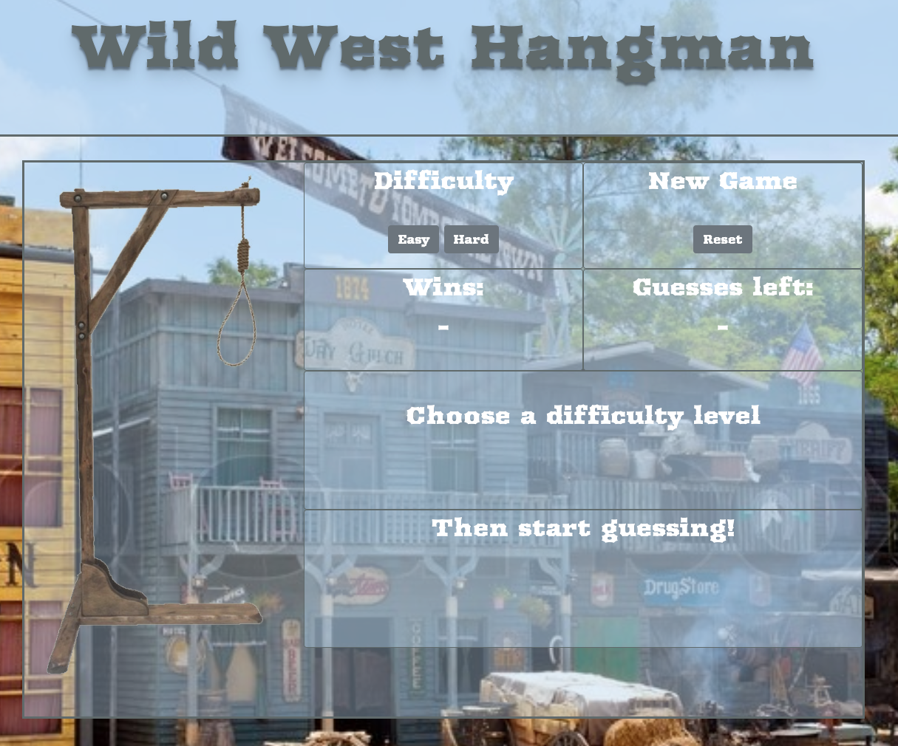

# Hangman

## About

Word guessing game.

## Getting Started

1. Select Difficulty
2. Use keyboard to guess letters
3. "Wins" will accumulate while you still have "Guesses left"

## Technologies

Built using using core front-end technologies. Structured using HTML5. Layout with Bootstrap4's grid system and basic CSS3 styling. Functionality is written with vanilla JavaScript.

- HTML5
- CSS3
    - Bootstrap 4
- JavaScript

## Author

[Mike Hume](https://mahume.github.io/)